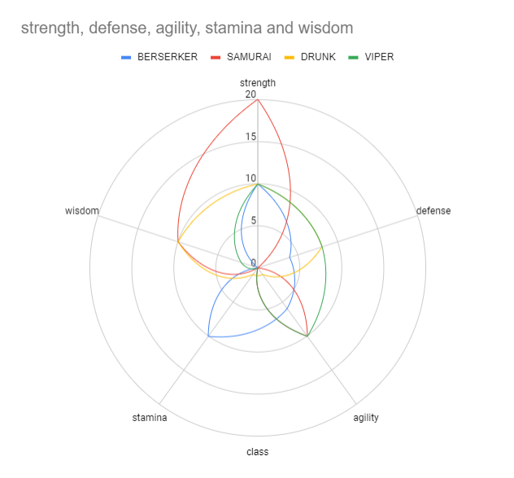

# What is this?

<p align="center">


</p>

This is a fighting game simulator built with pygame that blends RPG character build elements with the 1 v 1 fighting seen in games like Mortal Kombat and Street Fighter.

The game currently has 9 character archetypes (with both male and female versions) with varying stat builds for different strengths and weaknesses. Upon launching the game, the simulation randomly generates `FIGHTER_COUNT` "AI" fighters to fight in a simulated tournament (where `FIGHTER_COUNT` is specified in <a href="https://github.com/vibeznstuff/my-combat-death-tournament/blob/master/constants.py">constants.py</a>
). When a combatant is generated, there's a random chance that the combatant can be awarded three tiers of stat bonuses, denoted as a 'Rank'. Based on a uniform random variable U(0,1) dice roll, the combatant's rank is selected.


| Rank | Stat Bonus | Probability |
|---|---|---|
| Warrior | None | 1 - `ELITE_THRESHOLD` (Default = 75%) |
| Elite | +5 points to a single stat, picked at random | `ELITE_THRESHOLD` (Default = 25%) |
| Master | +5 points to 2 stats, both picked at random without replacement | `MASTER_THRESHOLD` (Default = 10%) |
| Legendary | +5 points to 4 stats, all picked at random without replacement | `LEGENDARY_THRESHOLD` (Default = 1%) |

> Note: In addition to the +5 stat bonus, one of the bonus options can also be increasing the combatant's health by `HEALTH_INCREASE_BONUS` (modifiable in <a href="https://github.com/vibeznstuff/my-combat-death-tournament/blob/master/constants.py">constants.py</a>
). By default, `HEALTH_INCREASE_BONUS` is set to 50%.
> Also, `ELITE_THRESHOLD`, `MASTER_THRESHOLD` and `LEGENDARY_THRESHOLD` are can all be modified within <a href="https://github.com/vibeznstuff/my-combat-death-tournament/blob/master/constants.py">constants.py</a>.


## How to Run the Combat Simulator

```python
python animate.py
```

## Stats Explanation

> **Note on 'Attacks' vs 'Attack Actions'**
>
> An 'Attack Action' is the act of a combatant proceeding to attack the opponent. Within an attack *action*, a combatant can land several attacks based on the combatant's agility stat (explained below).

- **Strength**: Determines the *magnitude of hit points that can be inflicted in a single attack. For example, a strength of 10 could inflict 10 damage points in a single attack depending on the opponent's **Defense**.
  - *The hit points dealt can be scaled with the `DAMAGE_MULTIPLIER` in <a href="https://github.com/vibeznstuff/my-combat-death-tournament/blob/master/constants.py">constants.py</a>
. This effects how many attacks it may take for a combatant to defeat an opponent.
- **Defense**: Determines how much the opponent's **Strength** attribute gets debuffed. For example, if the combatant has a **Defense** of 8 and the opponent has a **Strength** of 10, then the opponent can inflict 10 - 8 = *2* units of damage per attack. If the **Defense** attribute of the combatant is greater than or equal to the opponents **Strength** attrbibute, the combatant will only take 1 unit of damage per attack.
- **Agility**: Determines the maximum number of times a combatant can attack the opponent per *action*. This can also be thought of as a randomized damage multiplier. The number of actual attacks per attack *action* is randomly generated with a uniform distribution random variable as U(1, **Agility**). For example, if the combatant's **Agility** is 5, that means the combatant can attack the opponent up to 5 times in a single attack action. If the combatant's attack differential relative to the opponent is 4 (for example), it means the combatant can inflict anywhere from 4 damage points (4 x 1) to 20 damage points (4 x 5).
- **Stamina**: Determines the frequency at which the combatant can initiate attack *actions*. There is a default cooldown timer for each combatant to initiate an attack action. The default cooldown time is `DEFAULT_COOLDOWN` (currently set to 20 'moments'). The **Stamina** variable resets the combatant's cool down to `DEFAULT_COOLDOWN` - **Stamina**. In other words, the higher a combatant's stamina, the more often they will initiate attack actions.
  - `DEFAULT_COOLDOWN` can be modified in <a href="https://github.com/vibeznstuff/my-combat-death-tournament/blob/master/constants.py">constants.py</a>

- **Wisdom**: Determines the frequency at which the combatant can dodge enemy attacks. Similar to the **Agility** stat, the **Wisdom** stat involves a dice roll action to determine if the combatant dodges. The dice roll involves another random variable U(0,1) and if the random variable returns a value higher than `DODGE_THRESHOLD` then the combatant dodges the opponent's attack. The value of the **Wisdom** stat determines how many rolls the combatant has to be afforded a dodge action.
  - `DODGE_THRESHOLD` can be modified in <a href="https://github.com/vibeznstuff/my-combat-death-tournament/blob/master/constants.py">constants.py</a>
 and must be between (0,1)
- **Health**: The total hit points the combatant can take before being defeated. The health is currently calculated as follows: MAX(50, ( **Defense** x 6 + **Stamina** x 4 ) * `HEALTH_MULTIPLIER` )
  - `HEALTH_MULTIPLIER` is defined in <a href="https://github.com/vibeznstuff/my-combat-death-tournament/blob/master/constants.py">constants.py</a>
 and can be updated. This scales up the total health the combatants can have and effects how easily they can be defeated.

## Combatant Classes & Stats (*Default)


| Combatant Class | Strength | Defense | Agility | Stamina | Wisdom |
|---|---|---|---|---|---|
| Tank | 10 | 10 | 3 | 5 | 2 |
| Martial Artist | 5 | 5 | 9 | 7 | 4 |
| Tactician | 2 | 2 | 6 | 10 | 10 |
| Berserker | 10 | 4 | 6 | 10 | 0 |
| Heart | 5 | 10 | 5 | 6 | 4 |
| Hero | 6 | 7 | 3 | 7 | 7 |
| Samurai | 20 | 0 | 10 | 0 | 10 |
| Drunk | 10 | 8 | 1 | 1 | 10 |
| Viper | 10 | 8 | 10 | 0 | 2 |

<br>




*The above stat builds can be modified in <a href="https://github.com/vibeznstuff/my-combat-death-tournament/blob/master/combatant.py">combatant.py</a>.


### Default Combatant Class Summaries

- **Tank**
  - Strengths: Attack power, Defense
  - Weaknesses: Slow to attack, unlikely to dodge attacks
- **Martial Artist**
  - Strengths: Balanced / lack of weak stats
  - Weaknesses: Not particularly strong in any stat
- **Tactician**
  - Strengths: High chance of dodging attacks
  - Weaknesses: Low attack power & defense
- **Berserker**
  - Strengths: High attack power, high attack rate
  - Weaknesses: Low defense, will never dodge
- **Heart**
  - Strengths: High defense, balanced in other stats
  - Weaknesses: Not particularly strong offensively
- **Hero**
  - Strengths: Moderately high in all stats except agility
  - Weaknesses: Not particularly strong offensively
- **Samurai**
  - Strengths: Almost always lethal with attacks (usually kills on hit), high chance of dodging attacks
  - Weaknesses: Very low health and defense (usually dies when hit)
- **Drunk**
  - Strengths: High attack, high defense, and high chance of dodge
  - Weaknesses: Slow to attack, and will only hit a maximum of two times
- **Viper**
  - Strengths: High defense, very strong attack power
  - Weaknesses: Very slow to attack, unlikely to dodge

## Links to Sprites Used

Sprite Characters:
<https://www.spriters-resource.com/playstation_2/capvssnk2/>
